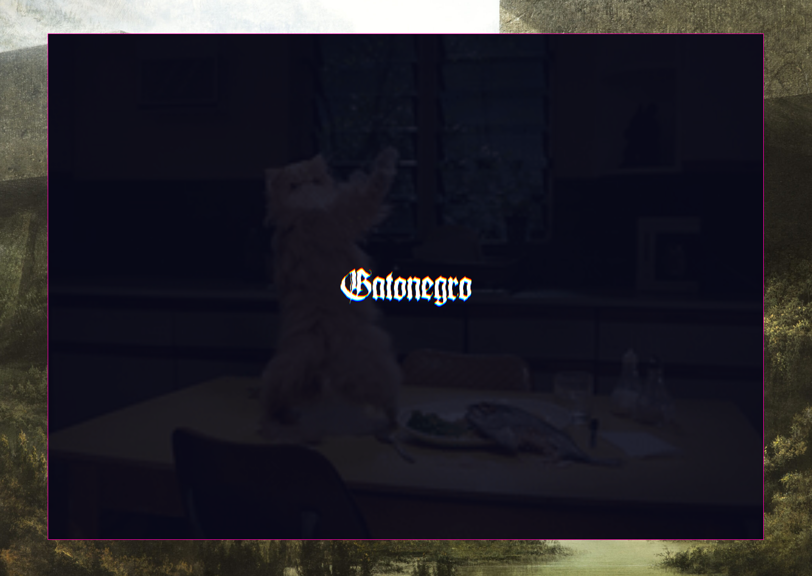
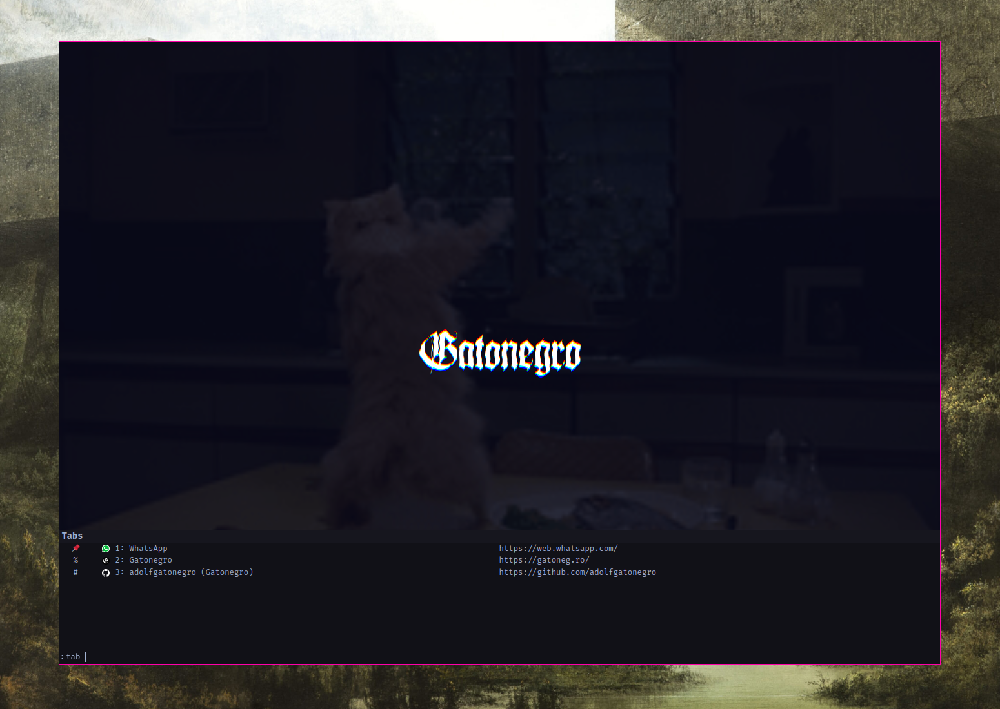
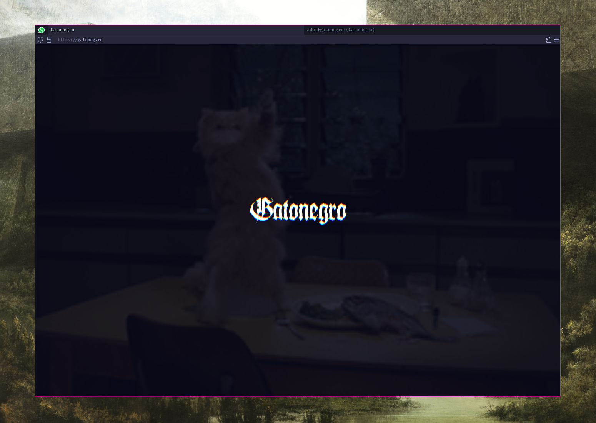

# qutefox-minimal userChrome.css

Keyboard-centric, qutebrowser-inspired userChrome.css for Firefox.

By default, every trace of the Firefox UI is hidden. My workflow is almost
exclusively keyboard-centric, and clickable UI elements are rarely used. By
using using [Tridactyl](https://github.com/tridactyl/tridactyl) (or a similar
extension, though they might lack some important features), almost every
operation in the browser can be done via the keyboard, and we can simply do away
with the GUI.

The toolbox (tabs, URL bar, bookmarks, etc.) are still accessible by hovering
over the top edge of the window, or by focusing on the URL bar with Ctrl+L. This
is the bit that was originally inspired by qutebrowser. The Firefox menu,
extensions, and other elements that might not be easily reached through keyboard
shortcuts can be accessed this way if necessary.

Even with everything visible, the UI is quite minimal and unobtrusive.

## How to use

Enable userchrome:

1) in `about:config` set `toolkit.legacyUserProfileCustomizations.stylesheets` to `true`

Enable compact mode:

1) in `about:config` set `browser.compactmode.show` to `true`
2) in the customize toolbar menu set `density` to `compact`

Enable dark theme in settings.

Copy `userChrome.css` to the `chrome` directory in your Firefox profile. If
there is no such directory create it. If you're unsure what the path to your
profile's directory is, you can find out by going to `about:profiles`.

## Credits

**qutefox-minimal** is a rework of [my firefox-minimal theme](https://github.com/adolfgatonegro/firefox-minimal), which was originally forked from [Dook97's userChrome.css](https://github.com/Dook97/firefox-qutebrowser-userchrome) and [aadilayub's original theme](https://github.com/aadilayub/firefox-i3wm-theme). The autohide\_toolbox code was adapted from MrOtherGuy's [firefox-csshacks](https://github.com/MrOtherGuy/firefox-csshacks).
